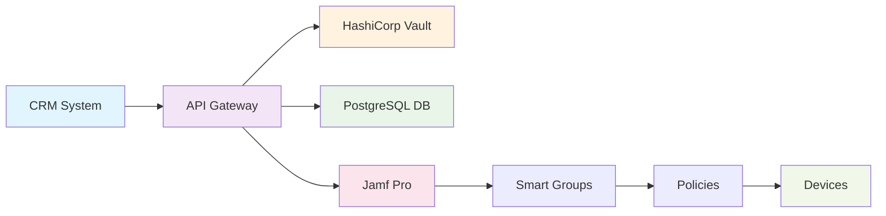

# Jamf Pro Bootstrap API

> **Automatic computer record creation in Jamf Pro with department-based policy application**

[](https://hub.docker.com/)
[](https://python.org)
[](https://flask.palletsprojects.com/)
[](LICENSE)

---

## Table of Contents

- [Overview](#overview)
- [Architecture](#architecture)
- [Security](#security)
- [API Endpoints](#api-endpoints)
- [Quick Start](#quick-start)
- [Setup](#setup)
- [Data Structure](#data-structure)
- [Troubleshooting](#troubleshooting)
- [Support](#support)

---

## Overview

**Jamf Pro Bootstrap API** is a high-reliability solution for automating device management in enterprise environments. The system provides secure integration between CRM systems and Jamf Pro, automatically applying policies based on employee department.

### Key Features

- **Multi-level Security** - data encryption and HashiCorp Vault integration
- **Automatic Policies** - department-based policy application
- **Full Monitoring** - comprehensive operation logging
- **Easy Deployment** - Docker containers and CI/CD
- **High Availability** - reliable architecture with redundancy

---

## Architecture



### Data Flow

1. **CRM** → Sends encrypted request
2. **API** → Validates token and decrypts data
3. **Vault** → Provides secrets and keys
4. **Jamf Pro** → Creates record and applies policies
5. **Devices** → Receive settings on check-in

---

## Security

> **Important**: Detailed security information is available in [SECURITY.md](SECURITY.md)

### Protection Levels

- **Authentication** - AppRole via HashiCorp Vault
- **Encryption** - Fernet with PBKDF2 for data
- **Integrity** - SHA256 checksum for verification
- **Tokens** - Validation of each request
- **Database** - SSL connection with PostgreSQL

---

## API Endpoints

| Method | Endpoint | Description | Authentication |
|--------|----------|-------------|----------------|
| `GET` | `/api/health` | API health check | ❌ |
| `GET` | `/api/policies` | Policy information | ❌ |
| `POST` | `/api/request` | Create CRM request | ✅ Token |
| `GET` | `/api/request/{id}` | Request status | ✅ API Key |
| `GET` | `/api/requests/crm/{crm_id}` | CRM requests | ✅ API Key |
| `POST` | `/api/process` | Process requests | ✅ Token |

---

## Quick Start

### Prerequisites

- Docker and Docker Compose
- HashiCorp Vault (configured)
- Google Cloud SQL PostgreSQL
- Jamf Pro with API access
- GCP VM for deployment

### Quick Installation

```bash
# 1. Clone repository
git clone https://github.com/your-org/jamf-pro-bootstrap.git
cd jamf-pro-bootstrap

# 2. Configure environment variables
cp .env.example .env
nano .env

# 3. Start with Docker Compose
docker-compose up -d

# 4. Check status
curl http://localhost:5000/api/health
```

---

## Setup

### HashiCorp Vault

#### Creating AppRole

```bash
# Enable AppRole auth method
vault auth enable approle

# Create policy
vault policy write jamf-bootstrap-policy -<<EOF
path "secret/jamf-bootstrap-*" {
  capabilities = ["read"]
}
path "secret/jamf-pro-*" {
  capabilities = ["read"]
}
path "secret/database-*" {
  capabilities = ["read"]
}
EOF

# Create AppRole
vault write auth/approle/role/jamf-bootstrap \
  token_policies="jamf-bootstrap-policy" \
  token_ttl=1h \
  token_max_ttl=4h

# Get Role ID
vault read auth/approle/role/jamf-bootstrap/role-id
```

#### Production Secrets

```json
// secret/jamf-bootstrap-prod
{
  "secret_key": "prod-secret-key-32-chars-long-here",
  "flask_debug": "False",
  "encryption_key": "prod-encryption-key-32-chars-long-here",
  "api_secret": "prod-api-secret-key-here"
}

// secret/jamf-pro-prod
{
  "url": "https://prod-jamf-pro-instance.com",
  "username": "prod_username",
  "password": "prod_password",
  "client_id": "prod_client_id",
  "client_secret": "prod_client_secret",
  "api_key": "prod_jamf_api_key"
}

// secret/database-prod
{
  "port": "5432",
  "name": "jamf_bootstrap_prod",
  "user": "jamf_user",
  "password": "your-database-password",
  "ssl_mode": "require",
  "ssl_ca": "-----BEGIN CERTIFICATE-----\n...\n-----END CERTIFICATE-----"
}
```

### Google Cloud PostgreSQL

```bash
# Create PostgreSQL instance
gcloud sql instances create jamf-bootstrap-db \
  --database-version=POSTGRES_15 \
  --tier=db-f1-micro \
  --region=us-central1 \
  --root-password=your-root-password

# Create database
gcloud sql databases create jamf_bootstrap_prod \
  --instance=jamf-bootstrap-db

# Create user
gcloud sql users create jamf_user \
  --instance=jamf-bootstrap-db \
  --password=your-password

# Configure private IP
gcloud sql instances patch jamf-bootstrap-db \
  --require-ssl \
  --authorized-networks=10.0.0.0/8
```

### Jamf Pro

#### Smart Groups

Create the following Smart Groups in Jamf Pro:

| Group | Criteria |
|-------|----------|
| `IT_Computers` | Department = "IT" |
| `HR_Computers` | Department = "HR" |
| `FINANCE_Computers` | Department = "Finance" |
| `MARKETING_Computers` | Department = "Marketing" |
| `SALES_Computers` | Department = "Sales" |
| `DEFAULT_Computers` | Department != "IT,HR,Finance,Marketing,Sales" |

#### API User

Create API user with permissions:
- Create/update/delete computers
- Manage Smart Groups
- Read policies

---

## Data Structure

### CRM Request

```json
{
  "crm_id": "crm-123",
  "request_type": "create",
  "payload": "encrypted-employee-data-base64",
  "encrypted_key": "encrypted-key-from-vault-base64",
  "token": "valid-token-from-vault"
}
```

### Employee Data

```json
{
  "employee_id": "E12345",
  "email": "sergei@pharmacyhub.com",
  "full_name": "User Name",
  "department": "IT",
  "device": {
    "serial": "C02XXXXX",
    "platform": "macOS",
    "os_version": "15.0"
  },
  "idempotency_key": "b2df428b-..."
}
```

### Supported Departments

| Department | Policies | Description |
|------------|----------|-------------|
| **IT** | Admin rights, Dev tools, Server access | Developers and system administrators |
| **HR** | Basic apps, Limited rights | HR department employees |
| **Finance** | Additional encryption, Audit | Finance department |
| **Marketing** | Creative apps, Design tools | Marketing department |
| **Sales** | CRM systems, Mobile policies | Sales department |
| **Default** | Basic security policies | Other departments |

---

## Troubleshooting

### Policies Not Applied

```bash
# 1. Check Smart Groups in Jamf Pro
# 2. Ensure policies are assigned to groups
# 3. Check API user permissions
# 4. Check API logs for errors

docker logs jamf-bootstrap-api | grep -i "policy"
```

### Device Not Receiving Settings

```bash
# 1. Ensure device is registered in Jamf Pro
# 2. Check device is in correct Smart Group
# 3. Force check-in
sudo jamf policy

# 4. Check MDM status on device
sudo profiles status -type configuration
```

### Encryption Errors

```bash
# 1. Check keys in Vault
vault read secret/jamf-bootstrap-prod

# 2. Check API logs
docker logs jamf-bootstrap-api | grep -i "encryption"

# 3. Check tokens
curl -H "X-API-Key: your-api-key" http://localhost:5000/api/health
```

---

## Support

### Contacts

- **Email**: sergei@pharmacyhub.com
- **Documentation**: [POLICIES.md](POLICIES.md)
- **Security**: [SECURITY.md](SECURITY.md)

### Additional Resources

- [Jamf Pro Documentation](https://docs.jamf.com/)
- [HashiCorp Vault Documentation](https://www.vaultproject.io/docs)
- [Google Cloud SQL Documentation](https://cloud.google.com/sql/docs)

### Report Issue

If you found a bug or have a suggestion for improvement:

1. Create Issue in GitHub
2. Describe the problem in detail
3. Attach logs and configuration
4. Specify system version

---

## License

This project is licensed under MIT License - see [LICENSE](LICENSE) file for details.

---

<div align="center">

**Made with ❤️ for device management automation**

[⬆️ Back to top](#jamf-pro-bootstrap-api)

</div>
