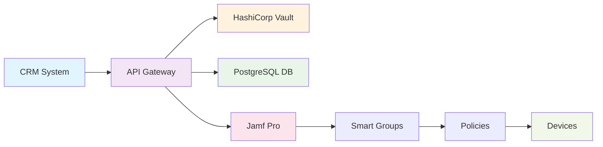

# Jamf Pro Bootstrap API

> **Автоматическое создание записей компьютеров в Jamf Pro с применением политик по отделам**

[](https://hub.docker.com/)
[](https://python.org)
[](https://flask.palletsprojects.com/)
[](LICENSE)

---

## Содержание

- [Обзор](#обзор)
- [Архитектура](#архитектура)
- [Безопасность](#безопасность)
- [API Endpoints](#api-endpoints)
- [Быстрый старт](#быстрый-старт)
- [Настройка](#настройка)
- [Структура данных](#структура-данных)
- [Troubleshooting](#troubleshooting)
- [Поддержка](#поддержка)

---

## Обзор

**Jamf Pro Bootstrap API** - это высоконадежное решение для автоматизации управления устройствами в корпоративной среде. Система обеспечивает безопасную интеграцию между CRM системами и Jamf Pro, автоматически применяя политики в зависимости от отдела сотрудника.

### Ключевые возможности

- **Многоуровневая безопасность** - шифрование данных и интеграция с HashiCorp Vault
- **Автоматические политики** - применение настроек по отделам
- **Полный мониторинг** - логирование всех операций
- **Простое развертывание** - Docker контейнеры и CI/CD
- **Отказоустойчивость** - надежная архитектура с резервированием

---

## Архитектура



### Поток данных

1. **CRM** → Отправляет зашифрованный запрос
2. **API** → Проверяет токен и расшифровывает данные
3. **Vault** → Предоставляет секреты и ключи
4. **Jamf Pro** → Создает запись и применяет политики
5. **Устройства** → Получают настройки при check-in

---

## Безопасность

> **Важно**: Подробная информация о безопасности находится в файле [SECURITY.md](SECURITY.md)

### Уровни защиты

- **Аутентификация** - AppRole через HashiCorp Vault
- **Шифрование** - Fernet с PBKDF2 для данных
- **Целостность** - SHA256 checksum для проверки
- **Токены** - Валидация каждого запроса
- **База данных** - SSL соединение с PostgreSQL

---

## API Endpoints

| Метод | Endpoint | Описание | Аутентификация |
|-------|----------|----------|----------------|
| `GET` | `/api/health` | Проверка здоровья API | ❌ |
| `GET` | `/api/policies` | Информация о политиках | ❌ |
| `POST` | `/api/request` | Создание запроса от CRM | ✅ Token |
| `GET` | `/api/request/{id}` | Статус запроса | ✅ API Key |
| `GET` | `/api/requests/crm/{crm_id}` | Запросы CRM | ✅ API Key |
| `POST` | `/api/process` | Обработка запросов | ✅ Token |

---

## Быстрый старт

### Предварительные требования

- Docker и Docker Compose
- HashiCorp Vault (настроенный)
- Google Cloud SQL PostgreSQL
- Jamf Pro с API доступом
- GCP VM для развертывания

### Быстрая установка

```bash
# 1. Клонирование репозитория
git clone https://github.com/your-org/jamf-pro-bootstrap.git
cd jamf-pro-bootstrap

# 2. Настройка переменных окружения
cp .env.example .env
nano .env

# 3. Запуск через Docker Compose
docker-compose up -d

# 4. Проверка статуса
curl http://localhost:5000/api/health
```

---

## Настройка

### HashiCorp Vault

#### Создание AppRole

```bash
# Включение AppRole auth method
vault auth enable approle

# Создание политики
vault policy write jamf-bootstrap-policy -<<EOF
path "secret/jamf-bootstrap-*" {
  capabilities = ["read"]
}
path "secret/jamf-pro-*" {
  capabilities = ["read"]
}
path "secret/database-*" {
  capabilities = ["read"]
}
EOF

# Создание AppRole
vault write auth/approle/role/jamf-bootstrap \
  token_policies="jamf-bootstrap-policy" \
  token_ttl=1h \
  token_max_ttl=4h

# Получение Role ID
vault read auth/approle/role/jamf-bootstrap/role-id
```

#### Секреты для продакшена

```json
// secret/jamf-bootstrap-prod
{
  "secret_key": "prod-secret-key-32-chars-long-here",
  "flask_debug": "False",
  "encryption_key": "prod-encryption-key-32-chars-long-here",
  "api_secret": "prod-api-secret-key-here"
}

// secret/jamf-pro-prod
{
  "url": "https://prod-jamf-pro-instance.com",
  "username": "prod_username",
  "password": "prod_password",
  "client_id": "prod_client_id",
  "client_secret": "prod_client_secret",
  "api_key": "prod_jamf_api_key"
}

// secret/database-prod
{
  "port": "5432",
  "name": "jamf_bootstrap_prod",
  "user": "jamf_user",
  "password": "your-database-password",
  "ssl_mode": "require",
  "ssl_ca": "-----BEGIN CERTIFICATE-----\n...\n-----END CERTIFICATE-----"
}
```

### Google Cloud PostgreSQL

```bash
# Создание экземпляра PostgreSQL
gcloud sql instances create jamf-bootstrap-db \
  --database-version=POSTGRES_15 \
  --tier=db-f1-micro \
  --region=us-central1 \
  --root-password=your-root-password

# Создание базы данных
gcloud sql databases create jamf_bootstrap_prod \
  --instance=jamf-bootstrap-db

# Создание пользователя
gcloud sql users create jamf_user \
  --instance=jamf-bootstrap-db \
  --password=your-password

# Настройка приватного IP
gcloud sql instances patch jamf-bootstrap-db \
  --require-ssl \
  --authorized-networks=10.0.0.0/8
```

### Jamf Pro

#### Smart Groups

Создайте следующие Smart Groups в Jamf Pro:

| Группа | Критерии |
|--------|----------|
| `IT_Computers` | Department = "IT" |
| `HR_Computers` | Department = "HR" |
| `FINANCE_Computers` | Department = "Finance" |
| `MARKETING_Computers` | Department = "Marketing" |
| `SALES_Computers` | Department = "Sales" |
| `DEFAULT_Computers` | Department != "IT,HR,Finance,Marketing,Sales" |

#### API Пользователь

Создайте API пользователя с правами:
- Создание/обновление/удаление компьютеров
- Управление Smart Groups
- Чтение политик

---

## Структура данных

### Запрос от CRM

```json
{
  "crm_id": "crm-123",
  "request_type": "create",
  "payload": "encrypted-employee-data-base64",
  "encrypted_key": "encrypted-key-from-vault-base64",
  "token": "valid-token-from-vault"
}
```

### Данные сотрудника

```json
{
  "employee_id": "E12345",
  "email": "sergei@pharmacyhub.com",
  "full_name": "User Name",
  "department": "IT",
  "device": {
    "serial": "C02XXXXX",
    "platform": "macOS",
    "os_version": "15.0"
  },
  "idempotency_key": "b2df428b-..."
}
```

### Поддерживаемые отделы

| Отдел | Политики | Описание |
|-------|----------|----------|
| **IT** | Административные права, Dev tools, Server access | Разработчики и системные администраторы |
| **HR** | Базовые приложения, Ограниченные права | Сотрудники HR отдела |
| **Finance** | Дополнительное шифрование, Аудит | Финансовый отдел |
| **Marketing** | Креативные приложения, Дизайн-инструменты | Маркетинговый отдел |
| **Sales** | CRM системы, Мобильные политики | Отдел продаж |
| **Default** | Базовые политики безопасности | Остальные отделы |

---

## Troubleshooting

### Политики не применяются

```bash
# 1. Проверьте Smart Groups в Jamf Pro
# 2. Убедитесь что политики назначены на группы
# 3. Проверьте права API пользователя
# 4. Проверьте логи API для ошибок

docker logs jamf-bootstrap-api | grep -i "policy"
```

### Устройство не получает настройки

```bash
# 1. Убедитесь что устройство зарегистрировано в Jamf Pro
# 2. Проверьте что устройство в правильной Smart Group
# 3. Принудительно запустите check-in
sudo jamf policy

# 4. Проверьте статус MDM на устройстве
sudo profiles status -type configuration
```

### Ошибки шифрования

```bash
# 1. Проверьте ключи в Vault
vault read secret/jamf-bootstrap-prod

# 2. Проверьте логи API
docker logs jamf-bootstrap-api | grep -i "encryption"

# 3. Проверьте токены
curl -H "X-API-Key: your-api-key" http://localhost:5000/api/health
```

---

## Поддержка

### Контакты

- **Email**: sergei@pharmacyhub.com
- **Документация**: [POLICIES.md](POLICIES.md)
- **Безопасность**: [SECURITY.md](SECURITY.md)

### Дополнительные ресурсы

- [Jamf Pro Documentation](https://docs.jamf.com/)
- [HashiCorp Vault Documentation](https://www.vaultproject.io/docs)
- [Google Cloud SQL Documentation](https://cloud.google.com/sql/docs)

### Сообщить о проблеме

Если вы обнаружили ошибку или у вас есть предложение по улучшению:

1. Создайте Issue в GitHub
2. Опишите проблему подробно
3. Приложите логи и конфигурацию
4. Укажите версию системы

---

## Лицензия

Этот проект лицензирован под MIT License - см. файл [LICENSE](LICENSE) для подробностей.

---

<div align="center">

**Сделано с ❤️ для автоматизации управления устройствами**

[⬆️ Наверх](#jamf-pro-bootstrap-api)

</div>
